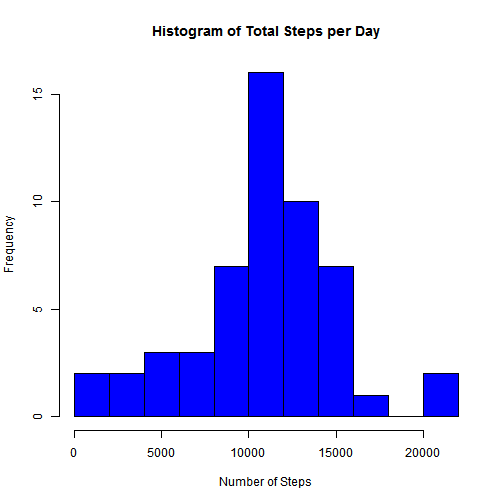
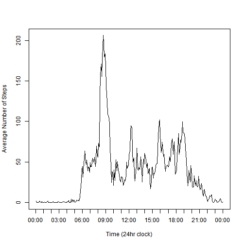
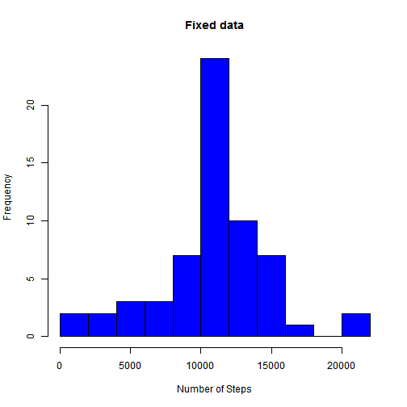
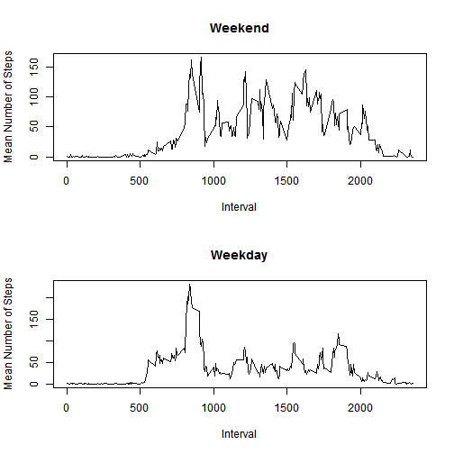

R Reproducible Research Assignment 1
========================================================

This Markdown file is my submission for the assignment.

## Loading and preprocessing the data

The file can be downloaded directly from the URL given in the assignment with the following code. It will place it in a temp file so it will be removed from our computer later.


```r
temp <- tempfile()
download.file("http://d396qusza40orc.cloudfront.net/repdata%2Fdata%2Factivity.zip"
        ,temp)
data <- read.csv(unz(temp,"activity.csv"))
unlink(temp)
```

Next, a version of the file is made without the NA values in "steps." This will make some of the later calculations easier.


```r
good_data <- subset(data,data$steps!="NA")
```
## What is mean total number of steps taken per day?

First we make the histogram. Some extra arguments were added for presentation purposes.


```r
# Use tapply to make a Vector of total steps per day
# The "date" column is a factor class already
totals <- tapply(good_data$steps,good_data$date,FUN=sum)
hist(totals,col = "blue", main = "Histogram of Total Steps per Day", xlab = "Number of Steps", breaks=8)
```

 

Next, the mean and median per day is displayed in a table.


```r
library(xtable)
mean <- mean(totals, na.rm=TRUE)
median <- median(totals, na.rm=TRUE)
table <- data.frame(mean = mean, median = median)
xt <- xtable(table)
print(xt, type="html",include.rownames=FALSE)
```

<!-- html table generated in R 3.1.0 by xtable 1.7-3 package -->
<!-- Thu Jun 12 21:40:12 2014 -->
<TABLE border=1>
<TR> <TH> mean </TH> <TH> median </TH>  </TR>
  <TR> <TD align="right"> 10766.19 </TD> <TD align="right"> 10765 </TD> </TR>
   </TABLE>

## What is the average daily activity pattern?

Average is another word for mean and good_data$steps has no NA values, so getting the average for each interval is just a tapply call with mean as the function.


```r
average_per_interval <- tapply(good_data$steps,good_data$interval,FUN=mean)
```

For the graph, I want to convert the interval from numbers between 0 and 2355 to times between 00:00 and 23:55. This will make it look a little better.


```r
# Create x-axis labels.
times <- seq(from = 0000, to = 2400, by = 100) #make digits
times <- formatC(times, width = 4, format = "d", flag = "0") #make into xxxx
times <- strftime(strptime(as.character(times),"%H%M"), "%H:%M") #make into xx:xx

##plot graph

plot(average_per_interval, type="l", xaxt="n", xlab="Time (24hr clock)", 
     ylab="Average Number of Steps")
axis(1, at=seq(from = 0, to = 288, by = 12), labels=times, pos=-8.5, las=0)
```

 

Return the Interval with the highest average number of steps.


```r
#find max value and its index
max.val <- max(average_per_interval)
max.loc <- which.max(average_per_interval)

#I'm taking an extra few steps here to find the start and end of the max interval
#and display it in the form "hh:mm - hh:mm."
intervals <- levels(factor(good_data$interval))
max.interval <- intervals[max.loc]
max.interval <- c(as.numeric(max.interval), as.numeric(max.interval) + 5)
max.interval <- formatC(max.interval, width = 4, format = "d", flag = "0")
max.interval <- strftime(strptime(as.character(max.interval),"%H%M"), "%H:%M")
max.interval <- paste(max.interval[1], "-", max.interval[2])

#Make Table
max.table <- data.frame(interval = max.interval, steps = max.val)
xt <- xtable(max.table )
print(xt, type="html",include.rownames=FALSE)
```

<!-- html table generated in R 3.1.0 by xtable 1.7-3 package -->
<!-- Thu Jun 12 21:40:12 2014 -->
<TABLE border=1>
<TR> <TH> interval </TH> <TH> steps </TH>  </TR>
  <TR> <TD> 08:35 - 08:40 </TD> <TD align="right"> 206.17 </TD> </TR>
   </TABLE>

## Inputing missing values

As we created a new dataset without NA values previously, we can find the number of missing entries by finding the difference between number of rows in each set.


```r
nrow(data)-nrow(good_data)
```

```
## [1] 2304
```

For filling in missing data, we're going to use the mean value for the interval.


```r
#create new dataframe for fixed data
fixed.data <- data

#for loop will run over each row and replace the NA value with the mean for that interval
for (row in 1:nrow(fixed.data)){
        if (is.na(fixed.data$steps[row])){
                interval.set <- fixed.data$interval[row] 
                steps.new <- subset(average_per_interval, 
                                    rownames(average_per_interval)==interval.set)
                fixed.data$steps[row] <- steps.new
        }
        
}
```

Now we will make a new histogram using the fixed data.


```r
totals2 <- tapply(fixed.data$steps,fixed.data$date,FUN=sum)
hist(totals2,col = "blue", main = "Fixed data", xlab = "Number of Steps", breaks=8)
```

 

Note that the Frequency is now higher for each bar and the jump is bigger as we get closer to the mean. This is because we are adding more values to the plot. Since the values we are adding are the mean per interval, the figures are skewed towards the overall mean.

Now we will find the new mean and medians and compare them to the old. As you will see, the difference is minimal.


```r
mean2 <- mean(totals2, na.rm=TRUE)
median2 <- median(totals2, na.rm=TRUE)
table <- data.frame(mean = c(mean, mean2, mean-mean2), median = c(median, median2, median-median2), row.names=c("Old","New","Change"))
xt <- xtable(table)
print(xt, type="html")
```

<!-- html table generated in R 3.1.0 by xtable 1.7-3 package -->
<!-- Thu Jun 12 21:40:13 2014 -->
<TABLE border=1>
<TR> <TH>  </TH> <TH> mean </TH> <TH> median </TH>  </TR>
  <TR> <TD align="right"> Old </TD> <TD align="right"> 10766.19 </TD> <TD align="right"> 10765.00 </TD> </TR>
  <TR> <TD align="right"> New </TD> <TD align="right"> 10766.19 </TD> <TD align="right"> 10766.19 </TD> </TR>
  <TR> <TD align="right"> Change </TD> <TD align="right"> 0.00 </TD> <TD align="right"> -1.19 </TD> </TR>
   </TABLE>

## Are there differences in activity patterns between weekdays and weekends?

First, we need to get the mean steps per interval over weekdays and weekends. We're going to use some formatting tricks to turn the dates into days, and then the data.table package to get aggregated means based on interval and whether its the weekend.


```r
#Turn dates into days of the week
dates <- fixed.data$date
dates <- strptime(as.character(dates), "%Y-%m-%d")
day.name <- weekdays(dates)
fixed.data$day.name <- day.name

# Turn the data.frame into a data.table
library(data.table)
fixed.data <- data.table(fixed.data)

#Use data.table aggregated grouping to find mean. The "by" argument is grouping
#based on matches between the interval column and whether day.name is in a weekend.
fixed.data[, means := mean(steps), by= list(interval, day.name %in% c("Saturday","Sunday"))]
```

Now, we need to split this into weekday and weekend charts with a single entry per interval. The assignment doesn't specify, so I'm going to define the weekend as "Saturday" and "Sunday."


```r
#split between weekend and weekday
weekday.data <- subset(fixed.data, !(fixed.data$day.name %in% c("Saturday","Sunday")))
weekend.data <- subset(fixed.data, fixed.data$day.name %in% c("Saturday","Sunday"))

# The data.table method above gives the same mean for each interval. The intervals 
# repeat every 288 rows so we need only take the first 288 elements.

weekday.data <- weekday.data[1:288,]
weekend.data <- weekend.data[1:288,]

# I'm using the basic plot functions to make the two graphs. In the assignment
# text it said to make the "same version", but I am unsure extactly how much it
# is okay to differ by. I'm hope that two graphs with the same data is enough.

par(mfrow = c(2,1))
plot(weekend.data$interval,weekend.data$means, type="l",xlab="Interval",ylab="Mean Number of Steps",main="Weekend")
plot(weekday.data$interval,weekday.data$means, type="l",xlab="Interval",ylab="Mean Number of Steps", main="Weekday")
```

 
